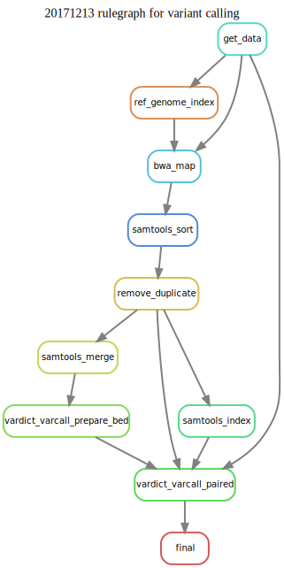
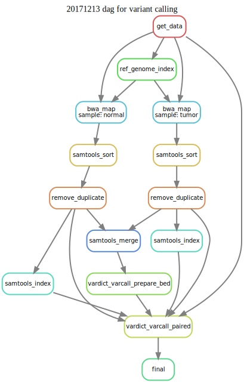
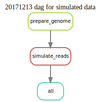
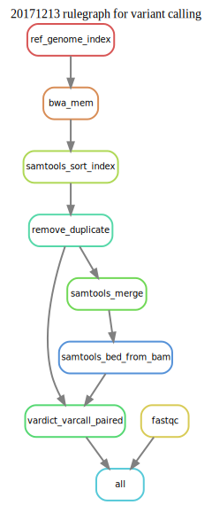
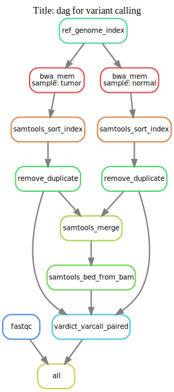

## Table of Content

1. [Vardict - SnakeMake's sample data](#1.Vardict)
	1. [Tools](#1.1.tools)

	2. [Dataset](#1.2.dataset)

	3. [Pipeline](#1.3.pipeline)
		* [Dataset 1](#1.3.1.SnakemakeData)
		* [Dataset 2](#1.3.2.SimulatedData)

## 1. Vardict - SnakeMake's sample data <a name="1.Vardict"></a>

A simple pipeline to run Vardict.

### 1.1 Choice of tools <a name="1.1.Tools"></a>

**Workflow manager**: [Snakemake](http://snakemake.readthedocs.io/en/stable/index.html) was used for workflow management. The choice is made because of its ease of use, rapid prototyping, and benchmarking made easy solution.

**Aligner**: BWA

**Post alignment QC and data preparation**: samtools, MarkDuplicates, fastqc

**Variant calling**: Vardict

--
### 1.2 Dataset <a name="1.2.dataset"></a>

Three major sources for dataset are sought:

1. Sample data from SnakeMake's tutorial which includes three fastq files and a genome.fa file (including bwa indexes)

2. Simulated data generated from wgsim/dwgsim from samtools toolset.

3. Real datasets from publicly available data. For example data from [notes.md](../../../notes/2017_November.md) on November 16, 2017

--
### 1.3 Pipeline <a name="1.3.pipeline"></a>

#### Dataset 1: Snakemake's tutorial data <a name="1.3.1.SnakemakeData"></a>

Running ```snakemake --forceall -p --snakefile Snakefile_vardict_tutorial_data``` should create the results and a data directory containing the following:

```
$tree ../../data/snakemake_tutorial_data_131217/
../../data/snakemake_tutorial_data_131217/
├── output
│   ├── calls
│   │   └── tumor_vs_normal.vcf
│   ├── logs
│   │   ├── bwa_mem
│   │   │   ├── normal.log
│   │   │   └── tumor.log
│   │   └── picard_stats
│   │       ├── normal.rmdup.bam.txt
│   │       └── tumor.rmdup.bam.txt
│   └── mapped_reads
│       ├── merged.bam
│       ├── merged.bed
│       ├── normal.bam
│       ├── normal.rmdup.bam
│       ├── normal.rmdup.bam.bai
│       ├── normal.sorted.bam
│       ├── tumor.bam
│       ├── tumor.rmdup.bam
│       ├── tumor.rmdup.bam.bai
│       └── tumor.sorted.bam
├── ref_data
│   ├── db
│   │   ├── genome.fa
│   │   ├── genome.fa.amb
│   │   ├── genome.fa.ann
│   │   ├── genome.fa.bwt
│   │   ├── genome.fa.fai
│   │   ├── genome.fa.pac
│   │   └── genome.fa.sa
│   └── samples
│       ├── normal.fastq
│       └── tumor.fastq
└── snakemake_tutorial_data.md

9 directories, 25 files
```

To generate graphs run the following within ```src/workflows```:

* Rulegraph:

```bash
GRAPHDATE=`date +%Y%m%d`
DAGTYPE="rulegraph"
snakemake --`echo $DAGTYPE` --forceall --snakefile Snakefile_vardict_tutorial_data \
	| sed "s/digraph snakemake_dag {/digraph snakemake_dag { labelloc=\"t\"\; label=\"${GRAPHDATE} ${DAGTYPE} for variant calling\"\;/g" \
	| dot -Tsvg > ../../img/varcall.${DAGTYPE}.${GRAPHDATE}.svg
open ../../img/varcall.${DAGTYPE}.${GRAPHDATE}.svg
echo -e "../../img/varcall.${DAGTYPE}.${GRAPHDATE}.svg"
unset GRAPHDATE
unset DAGTYPE
``` 


* Dag:

```bash
GRAPHDATE=`date +%Y%m%d`
DAGTYPE="dag"
snakemake --`echo $DAGTYPE` --forceall --snakefile Snakefile_vardict_tutorial_data \
	| sed "s/digraph snakemake_dag {/digraph snakemake_dag { labelloc=\"t\"\; label=\"Title: ${DAGTYPE} for variant calling\"\;/g" \
	| dot -Tsvg > ../../img/varcall.${DAGTYPE}.${GRAPHDATE}.svg
open ../../img/varcall.${DAGTYPE}.${GRAPHDATE}.svg
echo -e "../../img/varcall.${DAGTYPE}.${GRAPHDATE}.svg"
unset GRAPHDATE
unset DAGTYPE
``` 


#### Dataset 2: Simulated data <a name="1.3.2.SimulatedData"></a>

First step is to generate data by running ```snakemake --forceall --snakefile simulated_data.SnakeFile``` within ```/data/simulated_data_13121/```. It will create the following data structure. (Note: The reference genome Fasta file should be in the following path: ```../../../db/GRCh38/GRCh38.primary_assembly.genome.fa``` with a proper ```fai``` in the same path).

```
ref_data/
├── db
│   └── genome.fa
└── samples
    ├── normal.bfast.fastq
    ├── normal.bwa.read1.fastq
    ├── normal.bwa.read2.fastq
    ├── normal.mutations.txt
    ├── normal.mutations.vcf
    ├── tumor.bfast.fastq
    ├── tumor.bwa.read1.fastq
    ├── tumor.bwa.read2.fastq
    ├── tumor.mutations.txt
    └── tumor.mutations.vcf

2 directories, 11 files
```

And the rule graph is:

```bash
GRAPHDATE=`date +%Y%m%d`
DAGTYPE="dag"
snakemake --`echo $DAGTYPE` --forceall --snakefile simulated_data.SnakeFile \
	| sed "s/digraph snakemake_dag {/digraph snakemake_dag { labelloc=\"t\"\; label=\"${GRAPHDATE} ${DAGTYPE} for simulated data\"\;/g" \
	| dot -Tsvg > ../../img/simulated_data.${DAGTYPE}.${GRAPHDATE}.svg
open ../../img/simulated_data.${DAGTYPE}.${GRAPHDATE}.svg
echo -e "../../img/simulated_data.${DAGTYPE}.${GRAPHDATE}.svg"
unset GRAPHDATE
unset DAGTYPE
```



Now that we have simulated data ready, running ```snakemake --forceall -p --snakefile Snakefile_vardict_simulated_data``` from within ```src/workflows``` should create the results and a data directory containing the following:

```
---
```

One important difference with Snakefile for simulated data with tutorial data is the structure of Snakefile, which is based on reusable individual rules which are located within: ```snakemake_rules``` directory:

```
../snakemake_rules/
├── align
│   ├── bwa_mem.rule
│   └── samtools.rules
├── quality_control
│   ├── fastqc.rule
│   └── remove_duplicate.rule
├── ref_prepare
│   └── genome_fa.rule
└── variant_calling
    └── vardict.rule

4 directories, 6 files
```

To generate graphs run the following within ```src/workflows```:

* Rulegraph:

```bash
GRAPHDATE=`date +%Y%m%d`
DAGTYPE="rulegraph"
snakemake --`echo $DAGTYPE` --forceall --snakefile Snakefile_vardict_simulated_data \
	| sed "s/digraph snakemake_dag {/digraph snakemake_dag { labelloc=\"t\"\; label=\"${GRAPHDATE} ${DAGTYPE} for variant calling\"\;/g" \
	| dot -Tsvg > ../../img/varcall.simulateddata.${DAGTYPE}.${GRAPHDATE}.svg
open ../../img/varcall.simulateddata.${DAGTYPE}.${GRAPHDATE}.svg
echo -e "../../img/varcall.simulateddata.${DAGTYPE}.${GRAPHDATE}.svg"
unset GRAPHDATE
unset DAGTYPE
``` 


* Dag:

```bash
GRAPHDATE=`date +%Y%m%d`
DAGTYPE="dag"
snakemake --`echo $DAGTYPE` --forceall --snakefile Snakefile_vardict_simulated_data \
	| sed "s/digraph snakemake_dag {/digraph snakemake_dag { labelloc=\"t\"\; label=\"Title: ${DAGTYPE} for variant calling\"\;/g" \
	| dot -Tsvg > ../../img/varcall.simulateddata.${DAGTYPE}.${GRAPHDATE}.svg
open ../../img/varcall.simulateddata.${DAGTYPE}.${GRAPHDATE}.svg
echo -e "../../img/varcall.simulateddata.${DAGTYPE}.${GRAPHDATE}.svg"
unset GRAPHDATE
unset DAGTYPE
``` 


