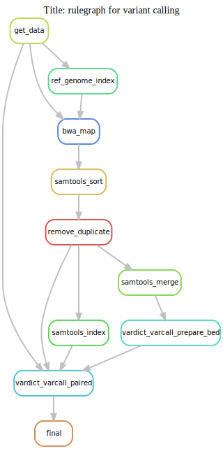
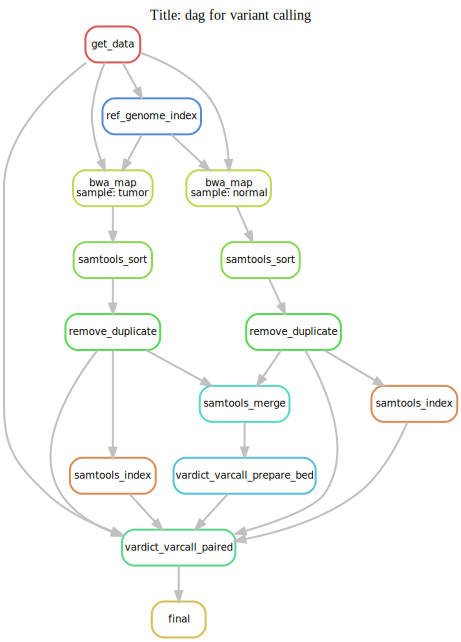

## Table of Content

1. [Vardict](#1.Vardict)
	1. [Tools](#1.1.tools)

	2. [Datasets](#1.2.datasets)

	3. [Pipeline](#1.3.pipeline)
		* [Dataset 1](#1.3.1.SnakemakeData)

## 1. Vardict <a name="1.Vardict"></a>

A simple pipeline to run Vardict is described below.

### 1.1 Choice of tools <a name="1.1.Tools"></a>

**Workflow manager**: [Snakemake](http://snakemake.readthedocs.io/en/stable/index.html) was used for workflow management. The choice is made because of its ease of use, rapid prototyping, and benchmarking made easy solution.

**Aligner**: BWA

**Post alignment QC and data preparation**: samtools and picard MarkDuplicates

**Variant calling**: Vardict

--
### 1.2 Datasets <a name="1.2.datasets"></a>

Three major sources for dataset are sought:

1. Sample data from SnakeMake's tutorial which includes three fastq files and a genome.fa file (including bwa indexes)
2. Simulated data generated from wgsim/dwgsim from samtools toolset.
3. Real datasets from publicly available data. For example data from [notes.md](../../../notes/2017_November.md) on November 16, 2017

--
### 1.3 Pipeline <a name="1.3.pipeline"></a>

#### Dataset 1: Snakemake's tutorial data <a name="1.3.1.SnakemakeData"></a>

Running ```snakemake --forceall -p``` should create the results and a data directory containing the following:

```
vardict_snakemake
$ tree .
.
├── Snakefile
├── output
│   ├── calls
│   │   └── tumor_vs_normal.vcf
│   ├── logs
│   │   ├── bwa_mem
│   │   │   ├── normal.log
│   │   │   └── tumor.log
│   │   └── picard_stats
│   │       ├── normal.rmdup.bam.txt
│   │       └── tumor.rmdup.bam.txt
│   └── mapped_reads
│       ├── merged.bam
│       ├── merged.bed
│       ├── normal.bam
│       ├── normal.rmdup.bam
│       ├── normal.rmdup.bam.bai
│       ├── normal.sorted.bam
│       ├── tumor.bam
│       ├── tumor.rmdup.bam
│       ├── tumor.rmdup.bam.bai
│       └── tumor.sorted.bam
└── ref_data
    ├── db
    │   ├── genome.fa
    │   ├── genome.fa.amb
    │   ├── genome.fa.ann
    │   ├── genome.fa.bwt
    │   ├── genome.fa.fai
    │   ├── genome.fa.pac
    │   └── genome.fa.sa
    └── samples
        ├── normal.fastq
        └── tumor.fastq

9 directories, 25 files
```

To generate graphs run the following within ```vardict_snakemake```:

* Rulegraph:

```bash
GRAPHDATE=`date +%Y%m%d`
DAGTYPE="rulegraph"
snakemake --`echo $DAGTYPE` --forceall \
	| sed "s/digraph snakemake_dag {/digraph snakemake_dag { labelloc=\"t\"\; label=\"Title: ${DAGTYPE} for variant calling\"\;/g" \
	| dot -Tsvg > ../../img/varcall.${DAGTYPE}.${GRAPHDATE}.svg
open ../../img/varcall.${DAGTYPE}.${GRAPHDATE}.svg
echo -e "../../img/varcall.${DAGTYPE}.${GRAPHDATE}.svg"
unset GRAPHDATE
unset DAGTYPE
``` 


* Dag:

```bash
GRAPHDATE=`date +%Y%m%d`
DAGTYPE="dag"
snakemake --`echo $DAGTYPE` --forceall \
	| sed "s/digraph snakemake_dag {/digraph snakemake_dag { labelloc=\"t\"\; label=\"Title: ${DAGTYPE} for variant calling\"\;/g" \
	| dot -Tsvg > ../../img/varcall.${DAGTYPE}.${GRAPHDATE}.svg
open ../../img/varcall.${DAGTYPE}.${GRAPHDATE}.svg
echo -e "../../img/varcall.${DAGTYPE}.${GRAPHDATE}.svg"
unset GRAPHDATE
unset DAGTYPE
``` 

